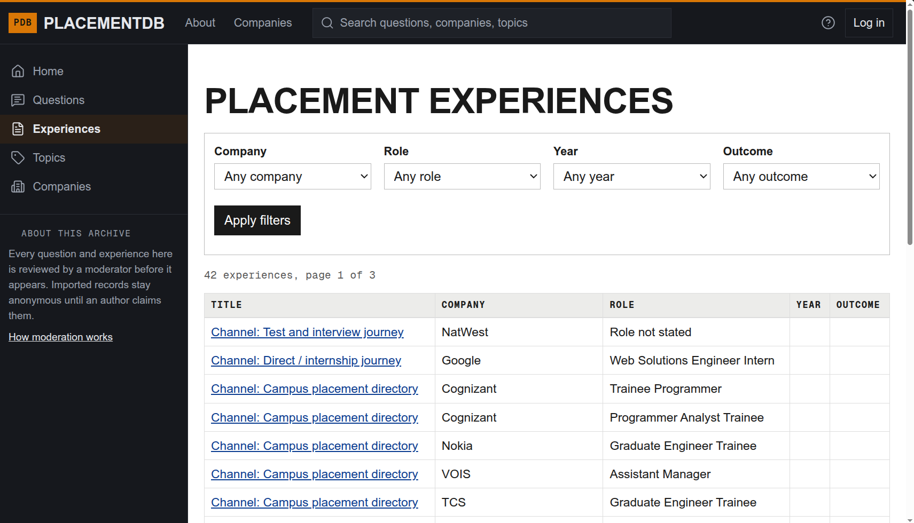

# PlacementDB

PlacementDB is a community question bank for interview questions and candidate experiences. Browse by company, role, year, and difficulty, or share what you encountered.




## Run locally

```sh
./start-dev.sh
```

Open `http://127.0.0.1:3000`. Press Ctrl-C to stop the whole stack.

For a production-mode preview, use `./start-prod.sh`.
